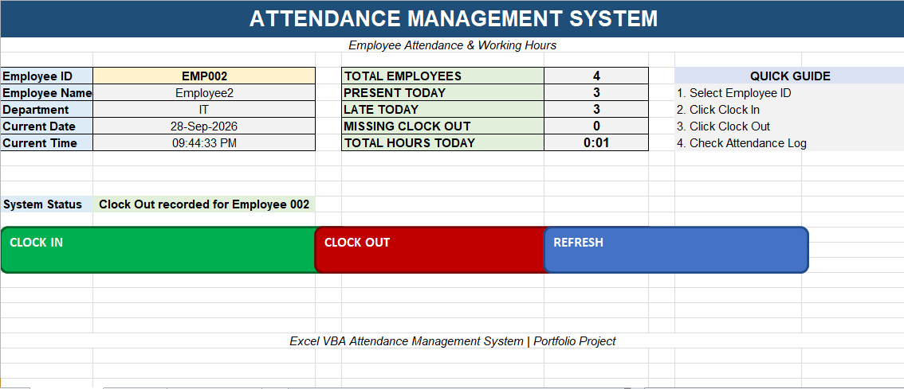
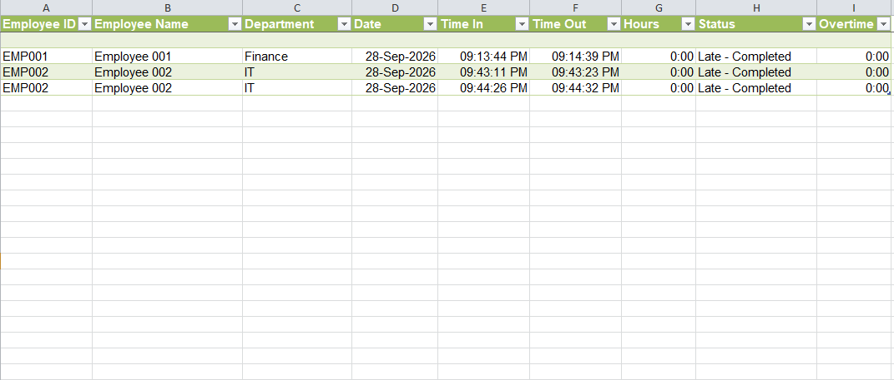

# Excel VBA Attendance Management System

An employee attendance management system built using Microsoft Excel and VBA. It records Clock In / Clock Out and automatically calculates working hours, late time, and overtime.

## ✨ Features
- One-click Clock In / Clock Out
- Automatic working-hours calculation
- Attendance Log sheet with daily records
- Dashboard with total hours, late arrivals
- VBA modular code (AttendanceSystem.bas)

## 📸 Screenshots
### Dashboard

### Attendance Log

## 🚀 How to Use
1. Download `Attendance_Log_System.xlsm`
2. Open it and **Enable Macros** when Excel asks
3. Click `Clock In` when you arrive, `Clock Out` when you leave
4. Check the `Attendance_Log` sheet for history
5. Check `Dashboard` for summary

## 🛠️ Tech Stack
- Microsoft Excel (.xlsm)
- VBA (Visual Basic for Applications)

## 📁 File Structure
Attendance_Log_System.xlsm (Main file)
AttendanceSystem.bas (VBA source code)
screenshots/ (Project images)
README.md

## 🔮 Future Improvements
- Monthly report generation
- Leave management
- Employee-wise filtering

## 👨‍💻 Author
**Siyath23** - First GitHub Project
